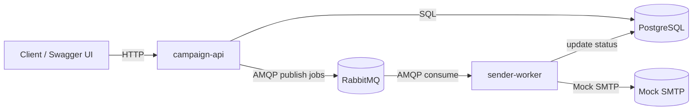

# MassMailer

Учебный pet-проект массовых e-mail-рассылок на микросервисной архитектуре.  

`campaign-api` принимает HTTP-запросы, создаёт кампании и публикует задания в очередь; `sender-worker` асинхронно «рассылает» письма (mock SMTP) и обновляет статусы в БД.
## Архитектура




## Стек

- **Go 1.23** (API/Worker), **PostgreSQL 15**, **RabbitMQ**, **Docker Compose**, **Makefile**, **GitHub Actions**  
- Документация API: **OpenAPI 3.0 + Swagger UI**
- Метрики : Prometheus
## Структура репозитория

```

MassMailer/

├─ .github/workflows/            # CI пайплайны (GitHub Actions)
├─ deployments/                  # docker-compose, .env и прочая оркестрация
├─ docs/                         # документация
├─ migrations/                   # SQL-миграции PostgreSQL
├─ services/
│  ├─ campaign-api/              # HTTP API сервис
│  └─ sender-worker/             # worker сервис (консьюмер очереди)
├─ pkg/                          # общие пакеты (типы, константы, обёртки)
├─ internal/                     # общая внутренняя утилитарка (если используется)
├─ Makefile                      # удобные команды: up/down/logs/migrate/…
├─ go.mod / go.sum               # корневые для монорепы (если требуется)
└─ README.md

```
## Быстрый старт

Создай .env файл

```bash
touch deployments/.env
```
Заполни данные конфига пример находится в файле .env.example

```bash

make up         # поднять Postgres, RabbitMQ, API, Worker

make migrate    # применить миграции

curl http://localhost:8080/healthz   # должно вернуть: ok

```
## Swagger / OpenAPI

Открой Swagger UI http://localhost:8080/docs и выполняй вызовы прямо из браузера:

GET /campaigns — список кампаний

POST /campaigns — создание кампании и планирование рассылки

GET /campaigns/{id} — детали кампании (со сводной статистикой)
## Ссылки и доступы (локально)

- Swagger UI: http://localhost:8080/docs
- RabbitMQ: http://localhost:30080/
- Prometheus: http://localhost:9095/targets
## Примерные ответы API

### 2) Создать кампанию — `POST /campaigns`
**Запрос**
```http

POST /campaigns HTTP/1.1

Host: localhost:8080

Content-Type: application/json

{
  "name": "October promo",
  "body": "Hello, this is a test.",
  "scheduled_at": "2025-10-07T18:00:00Z",
  "recipients": ["a@example.com", "b@example.com", "c@example.com"]
}
```
**Успешный ответ (202 Accepted)**
```json

{
  "id": 123,
  "name": "October promo",
  "status": "scheduled",
  "recipients_total": 3,
  "queued": true,
  "created_at": "2025-10-07T15:00:00Z"
}
```
**Ошибки (варианты)**
- `400 Bad Request` — некорректный JSON/валидация (пустое имя, пустой список recipients и т. п.).
- `500 Internal Server Error` — проблемы с БД/очередью и т. п.

---
### 3) Получить список кампаний — `GET /campaigns`
**Запрос**
```http
GET /campaigns?limit=20&offset=0 HTTP/1.1
Host: localhost:8080
```
**Ответ (200 OK)**
```json

[
  {
    "id": 123,
    "name": "October promo",
    "status": "scheduled",
    "scheduled_at": "2025-10-07T18:00:00Z",
    "created_at": "2025-10-07T15:00:00Z"
  },
  {
    "id": 122,
    "name": "Welcome flow",
    "status": "in_progress",
    "scheduled_at": "2025-10-06T12:00:00Z",
    "created_at": "2025-10-06T10:30:00Z"
  }
]
```
**Параметры**
- `limit` — количество записей (дефолт 20, максимальный — зависит от реализации).
- `offset` — смещение от начала списка.
---
### 4) Детали кампании — `GET /campaigns/{id}`
**Запрос**
```http
GET /campaigns/123 HTTP/1.1
Host: localhost:8080
```
**Ответ (200 OK)**
```json
{
  "id": 123,
  "name": "October promo",
  "body": "Hello, this is a test.",
  "status": "in_progress",
  "scheduled_at": "2025-10-07T18:00:00Z",
  "created_at": "2025-10-07T15:00:00Z",
  "stats": {
    "sent": 2,
    "failed": 1,
    "pending": 0
  },
  "recipients": [
    {"address": "a@example.com", "status": "sent",   "sent_at": "2025-10-07T18:01:03Z"},
    {"address": "b@example.com", "status": "failed", "last_error": "mock: smtp timeout"},
    {"address": "c@example.com", "status": "sent",   "sent_at": "2025-10-07T18:01:10Z"}
  ]
}
```
### Полезные команды Makefile
```bash
make up         # поднять всё окружение
make down       # остановить
make logs       # логи всех сервисов
make migrate    # прогнать миграции
```